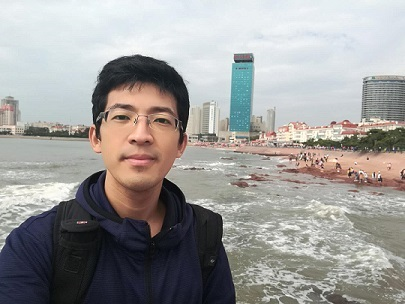
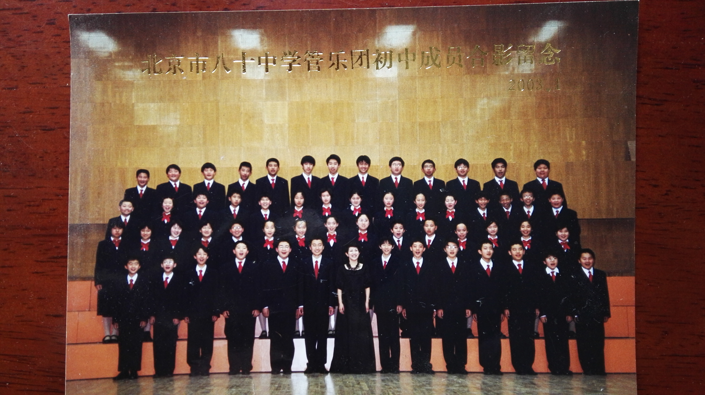
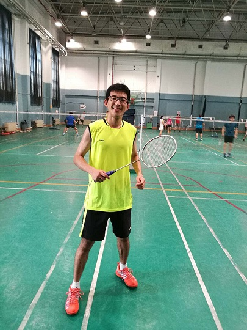
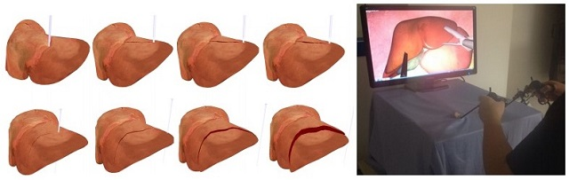
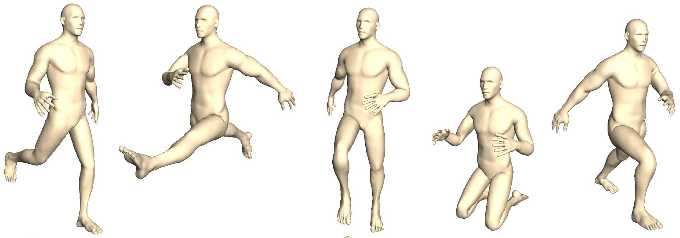
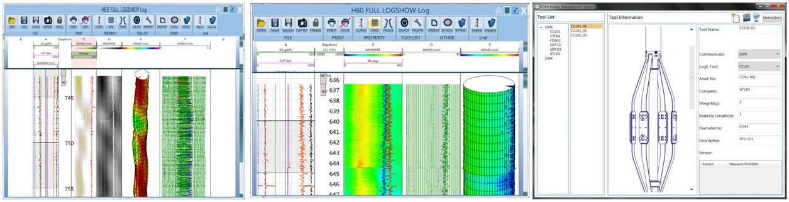

## Junxuan Bai&nbsp;(白隽瑄)

I am currently a PhD student of Computer Science at Beihang University since 2015. I got BSc in Mathematics from Dalian Maritime University in 2012, MSc in Computer Science from Beihang University in 2015. In 2010, I got a second prize in Liaoning Province in CUMCM. In 2011, I took part in COMAP Interdisciplinary Contest in Modeling (MCM/ICM) and got a Honorable Mention. In 2014, I got Kwang-Hua scholarship in Beihang University. My interests include physically-based animation, shape deformation and virtual reality.

Email: baijx6@163.com
  
  
 

---
## Intersects
- **Playing Clarinet**
  
- **Badminton**

---

## Projects

- **Real-time Simulation for Virtual Surgery**

- **Skeleton-based Skinning Method**
  

- **Displaying Platform for Crude Oil Logging Software**  

---

## Publications

- **Essential techniques for laparoscopic surgery simulation**  
Kun Qian, Junxuan Bai, Xiaosong Yang, JunJun Pan, Jian-Jun Zhang  
Computer Animation and Virtual Worlds 28(2) (2017)  
[Paper](https://drive.google.com/open?id=1_hw8Wz9c1EP4w7UZevRT3svW4pt2TwX9)&nbsp;&nbsp;
[Bib](http://dblp.uni-trier.de/rec/bibtex/journals/jvca/QianBYPZ17)

- **Real-time haptic manipulation and cutting of hybrid soft tissue models by extended position-based dynamics**  
Junjun Pan, Junxuan Bai, Xin Zhao, Aimin Hao, Hong Qin  
Computer Animation and Virtual Worlds 26(3-4): 321-335 (2015)  
[Paper](https://drive.google.com/open?id=1bEzvFh5RlZ2JNGK0qv5850q_dGNWosht)&nbsp;&nbsp;
[Bib](http://dblp.uni-trier.de/rec/bibtex/journals/jvca/PanBZHQ15)

- **Virtual reality based laparoscopic surgery simulation**  
	Kun Qian, Junxuan Bai, Xiaosong Yang, JunJun Pan, Jian-Jun Zhang  
 ACM VRST 2015: 69-78  
[Paper](https://drive.google.com/open?id=1yGW5Ui2ZaUQslhLyvycWg32MIWClgbTg)&nbsp;&nbsp;
[Bib](http://dblp.uni-trier.de/rec/bibtex/conf/vrst/QianBYPZ15)

- **Dissection of hybrid soft tissue models using position-based dynamics**  
JunJun Pan, Junxuan Bai, Xin Zhao, Aimin Hao, Hong Qin  
ACM VRST 2014: 219-220  
[Paper](https://drive.google.com/open?id=1oKg4tFlQe1P8JAobmbBc0MsRKxmSGXeR)&nbsp;&nbsp;
[Bib](http://dblp.uni-trier.de/rec/bibtex/conf/vrst/PanBZHQ14)

---

## Codes

