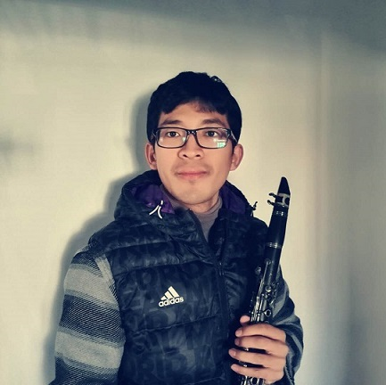

## Junxuan Bai&nbsp;(白隽瑄)

Junxuan Bai is currently a PhD candidate in Computer Science at [Beihang University](http://ev.buaa.edu.cn/). His supervisors are [Prof. Qinping Zhao](http://scse.buaa.edu.cn/info/1078/2628.htm) and [Prof. Junjun Pan](http://shi.buaa.edu.cn/jujun_pan/zh_CN/index.htm) in [State Key Laboratory of Virtual Reality Technology and Systems](http://vrlab.buaa.edu.cn/#). From 2012 to 2014, he developed a visualization platform for crude oil logging software with colleagues at [COSL](http://www.cosl.com.cn/col/col20611/index.html). From 2014 to 2015, he devised several algorithms on deformations and manipulations for soft tissue in virtual surgery. Recently, he designed a real-time skinning method for character animation based on metaballs model. He has published articles on [VRST 2014](http://conferences.inf.ed.ac.uk/vrst2014/program.html), [CASA 2015](http://event.ntu.edu.sg/casa/2015/Pages/index.aspx), [VRST 2015](https://vrst.acm.org/old/data/vrst2015/program.html), etc.. His interests include computer animation, physically-based deformation, shape deformation, virtual reality and visualization.

Email: **baijx6@163.com**
  
 

---
## Education

&nbsp; | **School** | **Year**
:-:|:---|:---:
&nbsp;&nbsp; 1 &nbsp;&nbsp; | [Beijing No.80 High School](http://www.bj80.com/) | 2005~2008
&nbsp;&nbsp; 2 &nbsp;&nbsp; | BSc in Mathematics, Dalian Maritime University | 2008~2012
&nbsp;&nbsp; 3 &nbsp;&nbsp; | MSc in Computer Science, Beihang University | 2012~2015  
&nbsp;&nbsp;&nbsp;&nbsp;&nbsp; | Supervisor: Prof. Aimin Hao | &nbsp;
&nbsp;&nbsp; 4 &nbsp;&nbsp; | PhD candidate in CS, Beihang University | 2015~now

## Award

&nbsp; | **Award** | **Year**
:---:|:---|:---:
&nbsp;&nbsp; 1 &nbsp;&nbsp; | Team champion in 2004 Beijing Music Competition for Middle Schools | 2004
&nbsp;&nbsp; 2 &nbsp;&nbsp; | 2nd Prize in 2010 Contemporary Undergraduate Mathematical Contest in Modeling (CUMCM) in Liaoning Province | 2010
&nbsp;&nbsp; 3 &nbsp;&nbsp; | Honorable Mention in 2011 COMAP Interdisciplinary Contest in Modeling (MCM/ICM) | 2011
&nbsp;&nbsp; 4 &nbsp;&nbsp; | GuangHua Scholarship, Beihang University | 2014
&nbsp;&nbsp; 5 &nbsp;&nbsp; | [3rd Prize in 2018 Design Competition for Acceptance Notice of Beihang University](./Admission_notice_2018.jpg) | 2018

---
## Intersects
- **Classical music**  
- **Art**
- [**Badminton**  ](./badminton.jpg)
- **Video Games**

---
## Projects

- **Real-time Simulation for Virtual Surgery** (C++)

- **Skeleton-based Skinning Method** (C++)
  

- **Displaying Platform for Crude Oil Logging Software** (C#)  

---

## Publications
- **Novel metaballs-driven approach with dynamic constraints for character articulation**  
Junxuan Bai, Junjun Pan, Yuhan Yang, Hong Qin  
SCIENCE CHINA Information Sciences, 2018, 61(9): 094101  
[Paper link](http://scis.scichina.com/en/2018/094101.html)

- **Essential techniques for laparoscopic surgery simulation**  
Kun Qian, Junxuan Bai, Xiaosong Yang, JunJun Pan, Jian-Jun Zhang  
Computer Animation and Virtual Worlds 28(2) (2017)  
[Paper](https://drive.google.com/open?id=1_hw8Wz9c1EP4w7UZevRT3svW4pt2TwX9)&nbsp;&nbsp;
[Bib](http://dblp.uni-trier.de/rec/bibtex/journals/jvca/QianBYPZ17)

- **Real-time haptic manipulation and cutting of hybrid soft tissue models by extended position-based dynamics**  
Junjun Pan, Junxuan Bai, Xin Zhao, Aimin Hao, Hong Qin  
Computer Animation and Virtual Worlds 26(3-4): 321-335 (2015)  
[Paper](https://drive.google.com/open?id=1bEzvFh5RlZ2JNGK0qv5850q_dGNWosht)&nbsp;&nbsp;
[Bib](http://dblp.uni-trier.de/rec/bibtex/journals/jvca/PanBZHQ15)

- **Virtual reality based laparoscopic surgery simulation**  
	Kun Qian, Junxuan Bai, Xiaosong Yang, JunJun Pan, Jian-Jun Zhang  
 ACM VRST 2015: 69-78  
[Paper](https://drive.google.com/open?id=1yGW5Ui2ZaUQslhLyvycWg32MIWClgbTg)&nbsp;&nbsp;
[Bib](http://dblp.uni-trier.de/rec/bibtex/conf/vrst/QianBYPZ15)

- **Dissection of hybrid soft tissue models using position-based dynamics**  
JunJun Pan, Junxuan Bai, Xin Zhao, Aimin Hao, Hong Qin  
ACM VRST 2014: 219-220  
[Paper](https://drive.google.com/open?id=1oKg4tFlQe1P8JAobmbBc0MsRKxmSGXeR)&nbsp;&nbsp;
[Bib](http://dblp.uni-trier.de/rec/bibtex/conf/vrst/PanBZHQ14)

---

## Codes

